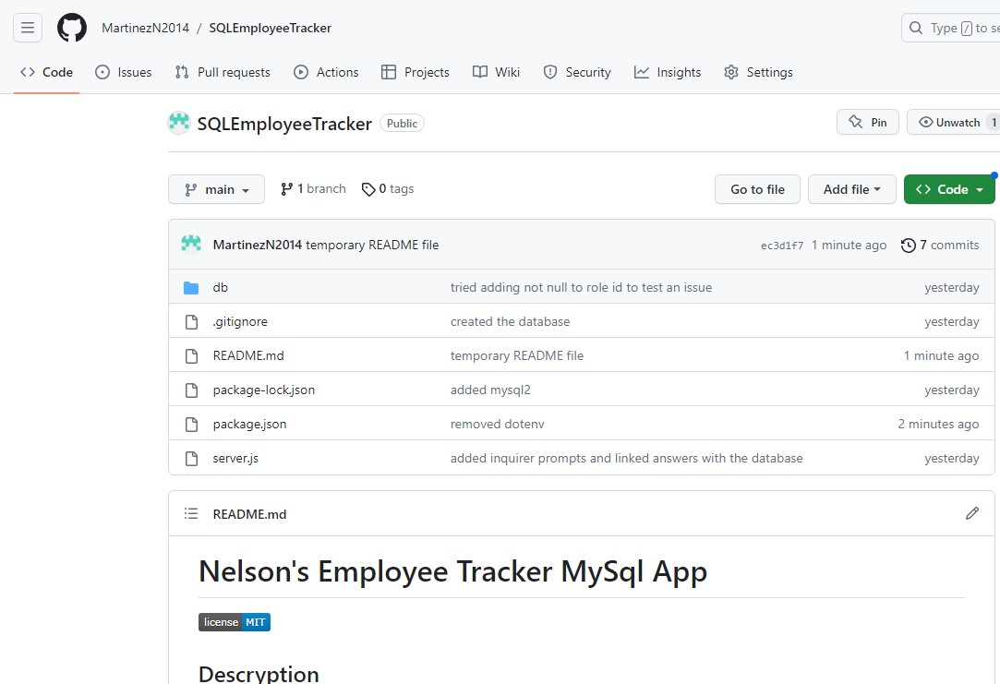

# Nelson's Employee Tracker MySql App

## Descryption

This app uses MySql and inquirer in order to make an employee manager. The employee manager lets you view departments, roles, and employee while also lets you update each one of those sections.

## Table of Contents

1. [Installation](#installation)
2. [Usage](#usage)
3. [Credits](#credits)
4. [License](#license)
5. [Features](#features)
6. [How to Contribute](#contribute)
7. [Test](#test)
8. [Questions](#questions)

## Installation

Clone it from my Repo

## Usage

Once all the packages have been install make sure to log into your mysql account and source the schema.sql and the seeds.sql. Then you can run "node server.js" to begin the prompts.

## Credits

https://shields.io/

## License

This application uses 

## Features

It uses Inquirer, Node.js, mysql2

## How to Contribute

Contact me.

## Test

Run test however you feel like it?

## Questions

GitHub: [MartinezN2014](https://github.com/MartinezN2014/SQLEmployeeTracker)
Email: [Email](2014nmartinez@gmail.com)

The youtube video of my project [link](https://www.youtube.com/watch?v=KFp9F4JnBzg)
